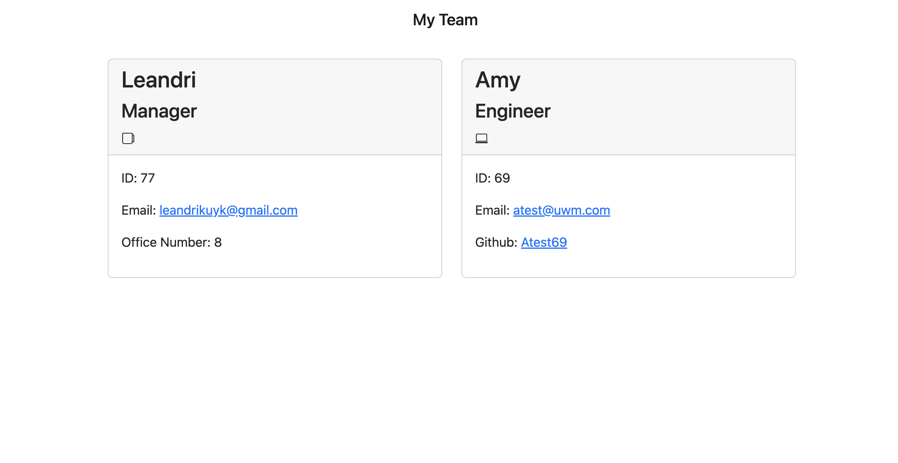

# Team Profile Generator

    The goal for this project was to generate a team member profile that includes all the necessary components to identify and contact a specific member of the team.

  ## Acceptance Criteria

  ````
    GIVEN a command-line application that accepts user input
    WHEN I am prompted for my team members and their information
    THEN an HTML file is generated that displays a nicely formatted team roster based on user input
    WHEN I click on an email address in the HTML
    THEN my default email program opens and populates the TO field of the email with the address
    WHEN I click on the GitHub username
    THEN that GitHub profile opens in a new tab
    WHEN I start the application
    THEN I am prompted to enter the team manager’s name, employee ID, email address, and office number
    WHEN I enter the team manager’s name, employee ID, email address, and office number
    THEN I am presented with a menu with the option to add an engineer or an intern or to finish building my team
    WHEN I select the engineer option
    THEN I am prompted to enter the engineer’s name, ID, email, and GitHub username, and I am taken back to the menu
    WHEN I select the intern option
    THEN I am prompted to enter the intern’s name, ID, email, and school, and I am taken back to the menu
    WHEN I decide to finish building my team
    THEN I exit the application, and the HTML is generated
  ````

  ## Contents

  - [Installation](#installation)
  - [Usage](#usage)
  - [Contributing](#contributing)
  - [Tests](#tests)
  - [License](#license)
  - [Questions](#questions)

  ## Installation

  Run the following command in your terminal in order to clone this repo:

  `npm install` and `node index.js` to run the application

  ## Usage
  
  

  ## Contributing

  In order to contribute, create a pull request and follow the steps listed below:

    - Fork the repo
    - Create a feature branch (git checkout -b NAME-HERE)
    - Commit your new feature (git commit -m 'Add some feature')
    - Push your branch (git push)
    - Create a new Pull Request

  Following a code review, your feature will be merged.

  ## Tests

  `npm run test`

  ## License

  [](https://opensource.org/licenses/MIT)

  This application is licensed under the MIT License.

  ## Questions

  If you have any questions, please contact me at my [email](mailto:leandrikuyk@gmail.com?subject=%20README%20Generator). You can find more of my work on my GitHub at [LeandriB](https://github.com/LeandriB). 